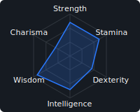
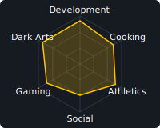
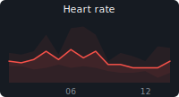
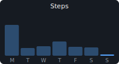
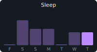
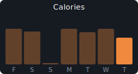
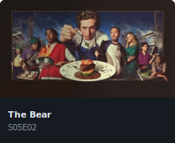
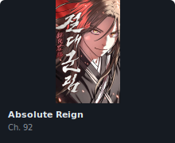
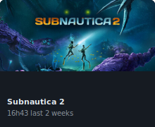

# Stéphane "Bakeneko" Dupont

*Ticket crusher, Git blamer, Goat farmer*

&nbsp;&nbsp;

 

 

👤&nbsp;<strong>37&nbsp;y/o</strong>&nbsp;&nbsp;·&nbsp;&nbsp;🏠&nbsp;Prissé, France&nbsp;&nbsp;·&nbsp;&nbsp;📍&nbsp;Prissé, France&nbsp;&nbsp;·&nbsp;&nbsp;🌙&nbsp;24.2°C&nbsp;&nbsp;·&nbsp;&nbsp;🟢&nbsp;Open to opportunities

❤️&nbsp;<strong>76&nbsp;bpm</strong>&nbsp;&nbsp;·&nbsp;&nbsp;⚖️&nbsp;<strong>82.4&nbsp;kg</strong>&nbsp;&nbsp;·&nbsp;&nbsp;👣&nbsp;<strong>1242&nbsp;steps</strong>&nbsp;&nbsp;·&nbsp;&nbsp;😴&nbsp;<strong>6h06</strong>&nbsp;&nbsp;·&nbsp;&nbsp;🔥&nbsp;<strong>1289&nbsp;kcal</strong>&nbsp;&nbsp;·&nbsp;&nbsp;💻&nbsp;<strong>368&nbsp;commits&nbsp;/&nbsp;30d</strong>

 

&nbsp;&nbsp;&nbsp;

 

&nbsp;&nbsp;

updated 2026-07-02T20:16:58.970Z

